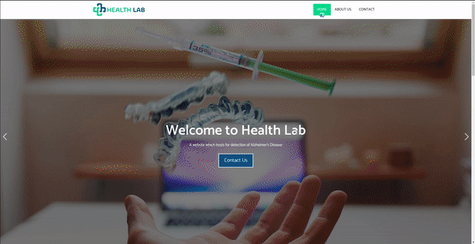

# Health Lab
<!--
[](https://www.python.org/)
[](#)<br>
[](https://github.com/Jeetu95/Brain-Tumor-Segmentation/graphs/commit-activity)
[](https://github.com/Jeetu95/Brain-Tumor-Segmentation/issues)
-->



## Table of Contents


>- [Introduction](#Introduction)
>- [Training](#Training)
>- [Results](#Results)
>- [Installation](#Installation)
>- [How to Use](#How_to_Use)


### Introduction:

We propose to implement a deep-learning framework that will segment the affected part of the brain in the MRI scans along with predicting severity of the alzheimer's disease.

We are going to deploy the model with simple interactive user interface - **Health Lab** on web platform.

Our [presentation](https://docs.google.com/presentation/d/1yVL8I-bt9WNGl4_27r4kq4FxgDIy60_ke0O30EIWrjg/edit#slide=id.gb1f8aa6de7_5_1810) and [demo_video](./demo/site_demo-2020-12-19_11.03.47.mp4)

### Training

- For Classification:

    [](https://colab.research.google.com/drive/1x57iiqQiPfG6mSG2dKtLMQkp1CaNDchy?usp=sharing#scrollTo=cKb2jNWrdTU9)

- For Semantic Segmentation:

    [](https://colab.research.google.com/drive/1u-vSPhU_hwaZdwsuABK4xCRet_jEp0Tu?usp=sharing)

### Results


### Installation

Fork this repository.

Then move to the desired directory in your PC and type in the terminal

```shell
git clone https://github.com/chetanpandey1266/FallFest-VWXYZ.git

cd web_app_with_ml_backend

pip install -r requirements.txt
```

Now your webapp is ready to run on your localhost😄

To run the web app

```shell

python app.py
```

This will run your site on localhost

### How_to_Use


For demo refer this [video](./demo/site_demo-2020-12-19_11.03.47.mp4)


